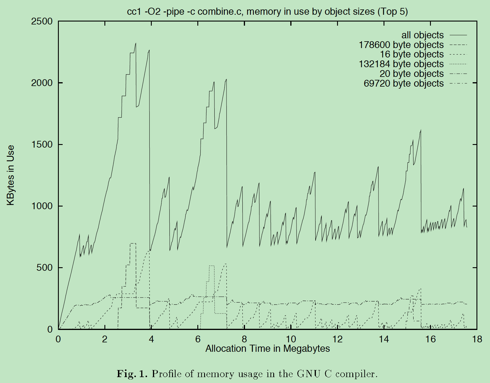
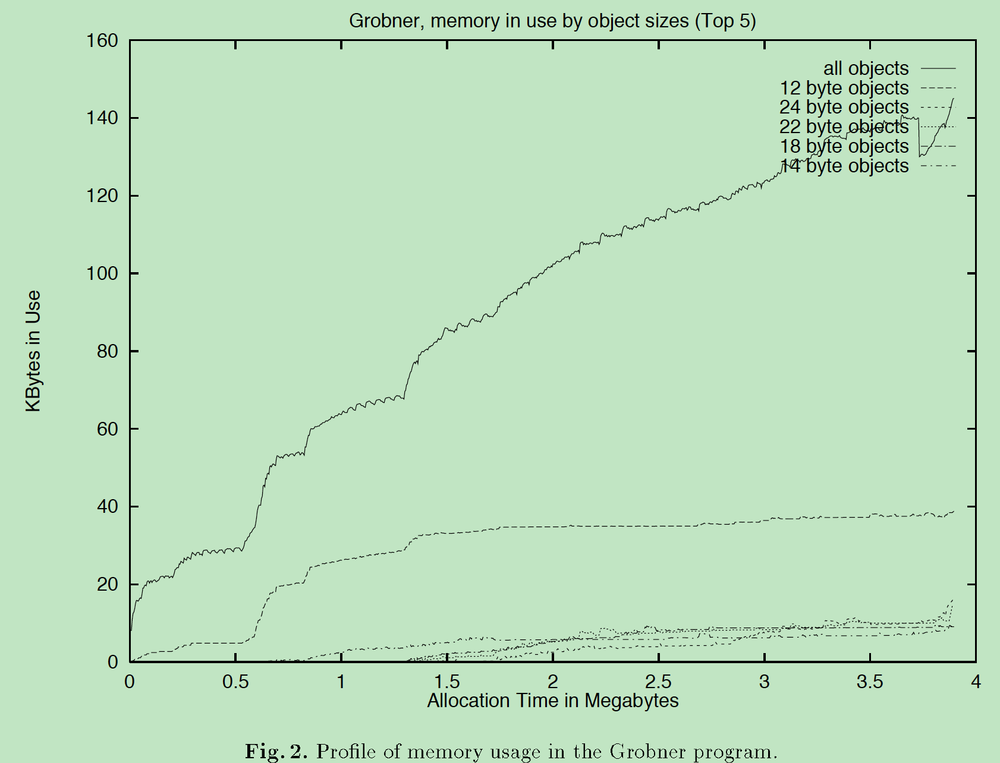
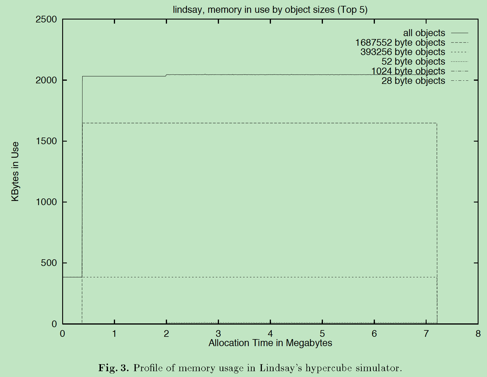
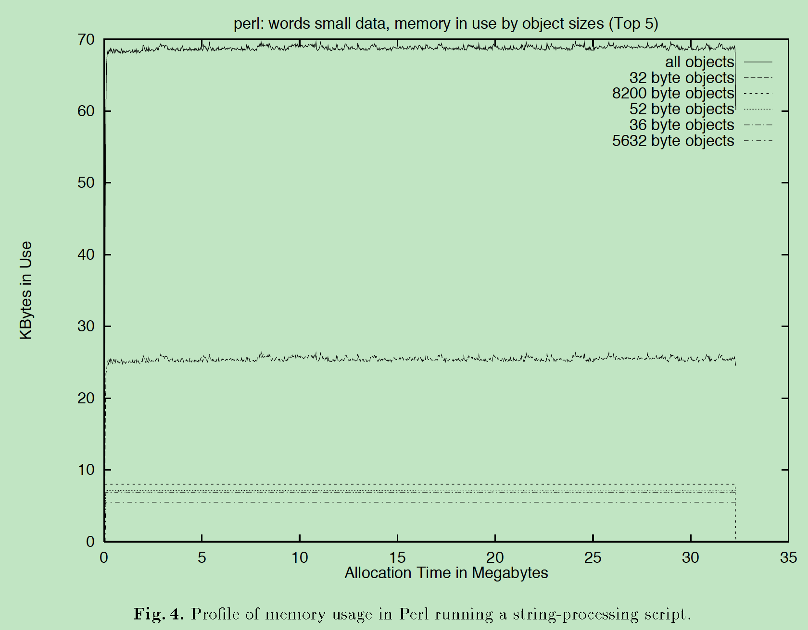
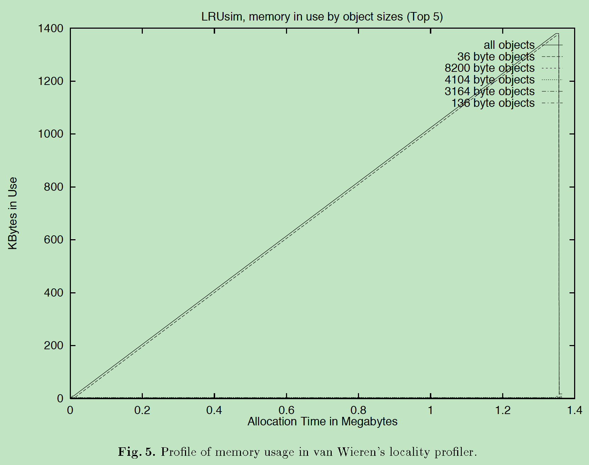
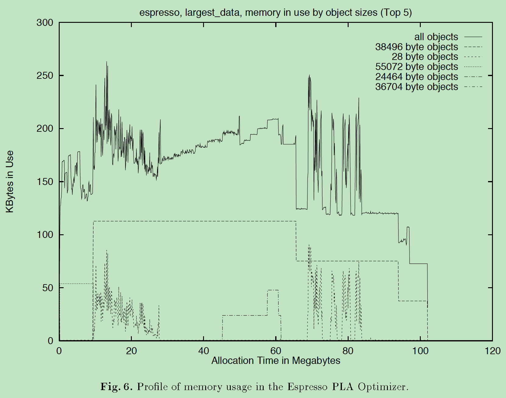

# Notes of Dynamic storage allocation: A survey and critical review

|时间|内容|
|:---|:---|
|20190507|kick off.|
|20190508|add 介绍.|
|20190509|add 碎片问题、分配器策略问题和底层机制.|
|20190513|add 顺序匹配、分离的空闲列表、伙伴系统、索引匹配、位图匹配和推迟合并.|

<!--
Purugganan M, Hewitt J. How to read a scientific article[J]. Rice University, 2004.

IMRD structure: Introduction, Methods, Results, and Discussion.

Before and during your reading, ask yourself these questions:
• Who are these authors? What journal is this? Might I question the credibility of the work?
• Have I taken the time to understand all the terminology?
• Have I gone back to read an article or review that would help me understand this work better?
• Am I spending too much time reading the less important parts of this article?
• Is there someone I can talk to about confusing parts of this article?

After reading, ask yourself these questions:
• What specific problem does this research address? Why is it important?
• Is the method used a good one? The best one?
• What are the specific findings? Am I able to summarize them in one or two sentences?
• Are the findings supported by persuasive evidence?
• Is there an alternative interpretation of the data that the author did not address?
• How are the findings unique/new/unusual or supportive of other work in the field?
• How do these results relate to the work I’m interested in? To other work I’ve read about?
• What are some of the specific applications of the ideas presented here? What are some further experiments that would answer remaining questions?
 -->


## 引用

<!--
Author(s), Date of publication, Title (book or article), Journal,Volume #, Issue #, pages:
If web access: url; date accessed
-->

```

@InProceedings{Wilson1995,
  author       = {Wilson, Paul R and Johnstone, Mark S and Neely, Michael and Boles, David},
  title        = {Dynamic storage allocation: A survey and critical review},
  booktitle    = {International Workshop on Memory Management},
  year         = {1995},
  pages        = {1--116},
  organization = {Springer},
}
```

动态存储分配: 调查和评判性综述

## 关键字

Memory Usage, Garbage Collection, Lifetime Distribution, Memory Allocation, Garbage Collector

## 主题

<!-- General subject, Specific subject -->

Memory Management

## 假设

传统的动态内存分配器<br/>
堆存储(heap storage), 程序请求内存块(block)以存储程序对象, 在任意时刻释放块.<br/>
堆: 内存池(pool of memory), 支持任意顺序任意大小内存块的分配和释放.<br/>

内存块被程序使用时, 不能使用内存压紧方法(例如拷贝性的垃圾收集器), 将其内容不能重定位.<br/>

分配器不检查或修改内存块中的数据; 不感知数据的类型和值, 只感知数据的大小.<br/>
块中用于存放对象的数据区域是一段连续且不重叠的(实际或虚拟)内存范围.<br/>

分配和释放的基本单位是块.<br/>

关注于整体内存使用问题, 而不是时间成本.<br/>

只简单的讨论局部性. 除非显式提出局部性问题, 假设内存单元的成本是固定的(fixed)和均匀的(uniform).<br/>
不考虑内存层次方案(memory hierarchy schema), 例如compressed caching: [WLM91, Wil91, Dou93]<br/>

不讨论特定应用中数据表示和分配器设计纠缠在一起的特殊的分配器.(例如: chained block message-buffers[Wol65], cdr-coded list processing system[BC79], 带共享结构的重叠字符串存储, 管理文件系统中磁盘存储的分配器)<br/>

假设: 高层对象的分裂(fragmenting)和压缩(compression), 在分配器接口抽象层之上已被处理, 分配器完全不感知对象(高层对象分裂后生成的对象)之间的关系.<br/>

不讨论并行分配器.


## 方法论

- survey
- sketch a unify conceptual framework
- suggest promising approaches for new research

## 结果

## 关键点总结

<!--
Document level
• Title
• Abstract
• Keywords
• visuals (especially figure and table titles)
• first sentence or the last 1-2 sentences of the Introduction

Paragraph level: words or phrases to look for
• surprising
• unexpected
• in contrast with previous work
• has seldom been addressed
• we hypothesize that
• we propose
• we introduce
• we develop
• the data suggest
-->

### 文章结构

```
1 Introduction..................................................................- P.1  
2  A Closer Look at Fragmentation and How to Study It...........................- P.8
2.1 Internal and External Fragmentation.........................................- P.8
2.2 The Traditional Methodology Probabilistic Analyses and Simulation Using Synthetic Traces...- P.9
2.3 What Fragmentation Really Is and Why the Traditional Approach is Unsound....- P.14
2.4 Some Real Program Behaviors.................................................- P.16
2.5 Deferred Coalescing and Deferred Reuse......................................- P.22
2.6 A Sound Methodology Simulation Using Real Traces............................- P.26
3  A Taxonomy of Allocators.....................................................- P.26
3.1 Allocator Policy Issues.....................................................- P.27
3.2 Some Important Low Level Mechanisms.........................................- P.27
3.3 Basic Mechanisms............................................................- P.30
3.4 Sequential Fits.............................................................- P.30
3.5 Discussion of Sequential Fits and General Policy Issues.....................- P.32
3.6 Segregated Free Lists.......................................................- P.36
3.7 Buddy Systems...............................................................- P.38
3.8 Indexed Fits................................................................- P.40
3.9 Bitmapped Fits..............................................................- P.41
3.10 Discussion of Basic Allocator Mechanisms...................................- P.42
3.11 Quick Lists and Deferred Coalescing........................................- P.43
3.12 A Note on Time Costs.......................................................- P.45
4  A Chronological Review of The Literature.....................................- P.46
4.1 The first three decades: 1960 to 1990.......................................- P.46
4.2 Recent Studies Using Real Traces............................................- P.65
5 Summary and Conclusions.......................................................- P.69
5.1 Models and Theories.........................................................- P.69
5.2 Strategies and Policies.....................................................- P.70
5.3 Mechanisms..................................................................- P.70
5.4 Experiments.................................................................- P.71     
5.5 Data........................................................................- P.71           
5.6 Challenges and Opportunities................................................- P.71
References......................................................................- P.72
```

### 术语

- allocator: 分配器
- allocation: 分配
- deallocation/free: 释放
- reclaiming free area: 回收生成空闲空间
- localilty: 局部性


- strategy: 策略, 战略
- placement policy: 放置策略
- splitting: 分裂
- coalescing: 合并

- fragmentation: 碎片
- deferred coalescing: 推迟合并
- deferred resue: 推迟重用

- asymptotic analysis: 渐进性分析
- tractable: 易处理的

- sequential fits: 顺序匹配
- segregated free lists: 分离的空闲列表
- buddy system: 伙伴系统
- indexed fits: 索引匹配
- bitmapped fits: 位图匹配
- quick lists: 快表


### 摘要

从大概1960年开始, 动态内存分配已经是大部分计算机系统的基础性一部分. 内存分配被普遍认为或者是已经解决的问题, 或者是不能解决的问题.

我们描述了多种内存分配器设计, 同时指出与设计和评估相关的问题.

接着, 我们按时间先后调查1961-1995期间分配器的文献(按不同细节程度讨论了大量论文, 给出了超过150个引用).

我们发现分配器设计过分的局限于机制(mechanism)而不是策略(policy), 后者更为重要; 高层战略性问题(strategic issues)也很重要, 但未被关注.

当前大部分分配器理论分析和经验性评估严重依赖于随机性(randomness)和独立性(independence)假设. 但现实中程序行为表现出重要的规则性(regularity), 分配器需要利用这些规则性以获得良好的性能.


### 介绍

**理想的分配器**

使用很少的时间管理内存, 浪费很少的空间.
分配器是一个在线算法(online algorithm), 必须立即有序响应请求, 其决策是不可撤销的.

应用程序可以在任意时刻申请分配或释放任意大小的块,
不存在可被证明的好的分配器算法;
存在任意分配器在一些可能的应用中变坏的证明.

最坏情形碎片的下界[Rob71]: $M log_{2}n$, $M$ 为活跃数据的数量, $n$ 为最大对象与最小对象大小的比值.

分配器保持碎片化可控的主要技术是 ==放置选择(placement choice)==.
两个实现选择的附带技术是 ==分裂(splitting)== 和 ==合并(coalescing)==.

一个分配器算法应该被视为实现放置策略(placement policy)的机制(mechanism), 放置策略是受最小化碎片的战略(strategy)驱动的.

**strategy, policy, mechanism**

在通用内存分配上下文中:

- strategy尝试利用请求流中的 ==规则性==;
- policy是在内存中放置块的可实现的 ==决策程序==;
- mechanism是实现策略的一组 ==算法和数据结构==.

strategy例子: avoid letting small long lived objects prevent you from reclaiming a larger contiguous free area

(best fit)policy例子: always use the smallest block that is at least large enough to satisfy the request

**splitting, coalescing**

- 将大块分裂为任意小的块, 使用小块满足分配请求;
- 将邻近的空闲块合并生成更大的块.
- 通用的分裂和合并总是可以以相对适中的空间和时间代价实现.
- deferred coalescing: 释放小块, 合并, 申请小块, 分裂大块; 合并动作被浪费了.

### 碎片(fragmentation)问题

#### 传统的研究方法论

- 分类: external, internal[Ran69]
- 外部碎片: 有可用于分配的一些内存空间, 但这些内存空间不能满足所请求的大小.
- 内部碎片: 没有好的匹配块, 除放置对象外的空间被浪费.

概率性分析(Probabilities Analysis)范式是错误的:

- (1) 对象数量很少, 不能应用渐进性分析(asympotic analyses);
- (2) 因程序行为, 存在系统性的相互影响(systematic interactions).

随机性和独立性假设上, 使用随机过程理论(stochastic processes, 例如Markov模型), 推导出预期行为的分析性结果.


虚构痕迹仿真(Simulation Using Synthetic Traces)

- traces: 分配和释放请求的记录序列
- 考虑了: 对象大小的分布, 对象存活时间分布

#### 新的方法论

==What Fragmentation Really Is?==

分配器不能重用内存, 不仅是依赖于空洞(hole)的数量和大小, 也依赖于程序未来的行为和分配器自身未来的响应决策.<br/>
Fragmentation is caused by isolated deaths.<br/>
Fragmentation is caused by time-varing hehaviour.

一些实际的程序行为

- (1) ramp: 爬坡
- (2) peak: 峰值
- (3) plateaus: 平稳

points:

- (1) ==程序行为== 通常是随时间变化的, 而不是稳定的;
- (2) 峰值内存使用率很重要, 峰值时碎片相比其他时刻的碎片更重要;
- (3) 碎片是由 ==随时间变化的行为== 产生的, 特别是使用不同大小对象产生峰值时;
- (4) 已知的程序行为, 将之前的实验和分析结果失效;
- (5) 可以利用 ==非随机的程序行为==;
- (6) 不同的程序可能展示出不同的非随机行为.

simulation using real traces: 使用实际痕迹的仿真

**deferred coalescing, deferred reuse**

- 推迟合并避免了合并很快再次分裂用于满足小块请求的块.
- 推迟重用是分配器属性, 倾向于不尽快使用最近释放的块.

### 分配器的分类系统(Taxonomy)

#### 分配器策略问题

内存重用模式(Patterns of Memory Reuse)

- (1) Are recently freed blocks reused in preference to older free areas?<br/>
最近释放的块是否在旧的空闲块之前优先重用?
- (2) Are free blocks in an area of memory preferentially reused for objects of the same size (and perhaps type) as the live objects nearby?<br/>
空闲块是否优先用于与附近活跃对象同大小(或者类型)的对象分配?
- (3) Are free blocks in some areas reused in preference to free blocks in other areas(eg preferentially reusing free blocks toward one end of the heap area)?<br/>
一些区域中的空闲块是否比其他区域中的空闲块优先使用(例如堆的一端)?

分裂和合并(Splitting and Coalescing)

- (1) Are large free blocks split into smaller blocks to satisfy requests for smaller objects?<br/>
大空闲块是否分裂为小块一满足小对象分配请求?
- (2) Are adjacent free blocks merged into larger areas at all?<br/>
邻近的空闲块是否合并为大空闲区域?
- (3) Are all adjacent free areas coalesced, or are there restrictions on when coalescing can be done because it simplifies the implementation?<br/>
是否所有的邻近空闲区域要合并? 是否存在简化实现的合并约束?
- (4) Is coalescing always done when its possible, or is it deferred to avoid needless merging and splitting over short periods of time?<br/>
合并是否在可以合并时总是发生, 或者被推迟已避免无用的短时期内的合并和分裂?

匹配(Fits)

- (1) When a block of a particular size is reused, are blocks of about the same size used preferentially or blocks of very different sizes?<br/>
申请分配特定大小的块时, 是否用相同大小的块或不同大小的块?
- (2) Or perhaps blocks whose sizes are related in some other useful way to the requested size?<br/>
决策分配的块的大小与申请分配的块的大小是否处在有用的关系?

分裂阈值(Splitting Thresholds)

- (1) When a too large block is used to satisfy a request, is it split and the remainder made available for reuse?<br/>
当决策一个大块用于满足分配请求时, 是否分裂它, 剩余的空间用于重用?
- (2) Or is the remainder left unallocated, causing internal fragmentation either for implementation simplicity or as part of a policy intended to trade internal fragmentation for reduced external fragmentation?<br/>
是否剩余空间保留为不分配, 导致内部碎片; 这是为了简化实现或者是用内部碎片减少外部随便的策略的一部分?

#### 底层机制

头部字段和字节对齐: 头部字段, 携带块大小、是否已分配等信息

边界标记(boundary tags): 尾部字段, 方便块合并

块中的链接字段: 使用空闲链表或索引树跟踪空闲块信息<br/>
previous, next<br/>
left child, right child, parent

查找表<br/>
分配器将在处于给定大小范围内的块视为类似的, 而不是使用精确的大小.<br/>
查找表: 数组, 索引为大小, 值为范围.

特殊处理小对象<br/>
系统内分配比大对象数量更多的小对象时.<br/>
对小对象使用快分配技术, 对大对象使用空间高效的技术.

特殊处理堆的末尾块<br/>
分配器必须从其他地方获取内存(例如操作系统).<br/>
分配器保留一个高水位线标记(high-water mark), 以区分内存是否用于满足程序分配请求.

#### 基本机制

基本按分配器的 ==机制== 做区分:

- (1) 顺序匹配(Sequential Fits): first fit, next fit, best fit, worst fit
- (2) 分离的空闲列表(Segregated Free List): 简单的分离存储, 分离匹配
- (3) 伙伴系统(Buddy System): binary buddies, weighted buddies, Fibonacci buddies, double buddies
- (4) 索引匹配(Indexed Fits): 使用结构化索引实现匹配策略
- (5) 位图匹配(Bitmapped Fits): 使用位图, 是索引匹配的特例

##### 顺序匹配(Sequential Fits)

best fit(最佳匹配)<br/>
分配器搜索空闲列表, 找到满足请求的最小空闲块

first fit(首次匹配)<br/>
从空闲列表开始处搜索, 找到第一个满足请求的空闲块<br/>
What ordering is used so that the “first” fit can be found?<br/>
When a block is freed, at what position is it inserted into the ordered set of free block?<br/><br/>
LIFO order, address order, FIFO order

Next fit(下次匹配)[Knu73]<br/>
流动指针(roving pointer): 记录上次满足请求时搜索停止的位置, 下次搜索从这里开始.

一些关于顺序匹配的讨论: 略.

##### 分离的空闲列表(Segregated Free List)

使用空闲列表的数组, 每个列表中记录特定大小的空闲块[Com64]

simple segregated storage(简单分离的存储)<br/>
满足小块请求时, 不分裂空闲块.<br/>
当特定大小的空闲列表中没有空闲块可用时从系统内存中分配新的空闲块. 通常一次性分配1或2个虚拟内存页, 每页分裂为同样大小的块.

segregated fits(分离匹配)<br/>
使用空闲列表的数组, 每个列表中记录特定大小类(size class)的空闲块.<br/>
当需要满足空闲块请求时, 在相应大小类的空闲列表中搜索, 搜索通常是顺序搜索.<br/>
如果相应的空闲列表中没有满足请求的空闲块时, 在较大的大小类中搜索并分裂空闲块.<br/>
如果搜索最终失败, 从系统内存中分配新的空闲块.<br/>
三种类型的方案:<br/>
(1) exact lists: 对每个可能申请的块大小, 都有相应的空闲列表<br/>
(2) strict size classes with rounding: 各空闲列表中块大小相同<br/>
(3) size class with range lists: 各空闲列表中块大小在一范围内

##### 伙伴系统(Buddy System)

伙伴系统[Kno65, PN77]是分离的列表的变种, 支持有限但高效的分裂和合并.

空闲块只能与其伙伴合并, 这个伙伴是在二元层次划分的同一层中唯一的邻居.

当释放一个块时, 其伙伴总是可以通过简单的地址运算获得, 并且其伙伴总是或者是完整的空闲块, 或者是不可用的(unavailable)块. 不可用的块可以是整体被使用的、已被分裂(部分已被使用).

在实际使用中, 伙伴系统中每个申请空闲块的对象中使用头部记录对象类型和/或其大小.


**binary buddies**<br/>
所有的伙伴大小是2的幂, 每个大小可以被分离为两个大小相同的部分.

**Fibonacci buddies**<br/>
基于Fibonacci级数指定大小类, 以减少内部碎片.

**weighted buddies**<br/>
两种大小类: 2的幂, 2的幂的3倍; 可以按一种方式分裂, 另一种可以按两种方式分裂<br/>
级数: 2, 3, 4, 6, 8, 12, ...

**double buddies**<br/>
使用两个不同的二元伙伴级数, 交错的大小, 例如:<br/>
级数(1): 2, 4, 8, 16, ...<br/>
级数(2): 3, 6, 12, 24, …<br/>
空闲块只能分裂为两部分, 这样块只能在同一个伙伴级数中.

##### 索引匹配(Indexed Fits)

按策略关注的特质索引块, 支持高效按这些特征高效搜索.<br/>
例: 按块大小排序的平衡或自适应二叉树.

“Fast Fits”分配器[Ste83]<br/>
使用按大小和地址排序的Cartesian tree(笛卡尔树)[Vui80].<br/>
按主键和次键排序, 按主键是全序树, 按次键是堆数据结构.

##### 位图匹配(Bitmapped Fits)

使用位图记录数据堆中的部分是否被使用.

就作者所知位图未被使用在分配器中, 但在标记清理垃圾收集和文件系统磁盘块管理中经常使用.

#### 推迟合并(Deferred Coalescing)

使用称为quick lists/subpools[MPS71]的空闲列表数组, 按块大小分别组织空闲列表, 记录被推迟合并的块.<br/>
通常只推迟合并一些大小的块, 通常是小块.

对通常的分配器来说, 快表中的块是不可用于分配的.<br/>
当分配小块时, 优先在快表中查找.

**合并调度**<br/>
早期, 在内存即将耗尽时合并.<br/>
在不执行合并或申请新内存的情况下无法满足请求时执行合并.<br/>
周期性的执行合并.


## 上下文

<!-- how this article relates to other work in the field; how it ties in with key issues and findings by others, including yourself -->

普遍认为动态内存分配是已经解决的问题或不可解决的问题.

使用随机性和独立性假设进行概率分析方法, 使用虚构的痕迹仿真, 而未考虑程序内部表现出的规则性特征.


## 意义

<!-- Significance to the field; in relation to your own work -->

内存分配技术的通用参考指南.

作为内存分配领域中参考文献和方法论的综述.

新的碎片化及其产生原因的构想; 更恰当的研究方法.


## 重要的图表

<!-- brief description; page number -->

### Fig.1.  Profile of memory usage in the GNU C compiler(P.20)


### Fig.2.  Profile of memory usage in the Grobner program(P.21)


### Fig.3.  Profile of memory usage in Lindsays hypercube simulator(P.22)


### Fig.4.  Profile of memory usage in Perl running a string processing script(P.23)


### Fig.5.  Profile of memory usage in van Wierens locality profiler(P.24)


### Fig.6.  Profile of memory usage in the Espresso PLA Optimizer(P.25)


## 引用的重要文献

<!-- cite those obviously related to your topic AND any papers frequently cited by others because those works may well prove to be essential as you develop your own work -->

垃圾收集器: [Wil95]

作者的另一篇技术报告[WJNB95]<br/>
Paul R. Wilson, Mark S. Johnstone, Michael Neely and David Boles. Memory allocation policies reconsidered. Technical report, University ofTexas at Austin Department of Computer Sciences, 1995.

伙伴系统[Kno65, PN77]


## 其他备注

Cartesian tree(笛卡尔树)[Vui80]
https://zh.wikipedia.org/wiki/%E7%AC%9B%E5%8D%A1%E5%B0%94%E6%A0%91
